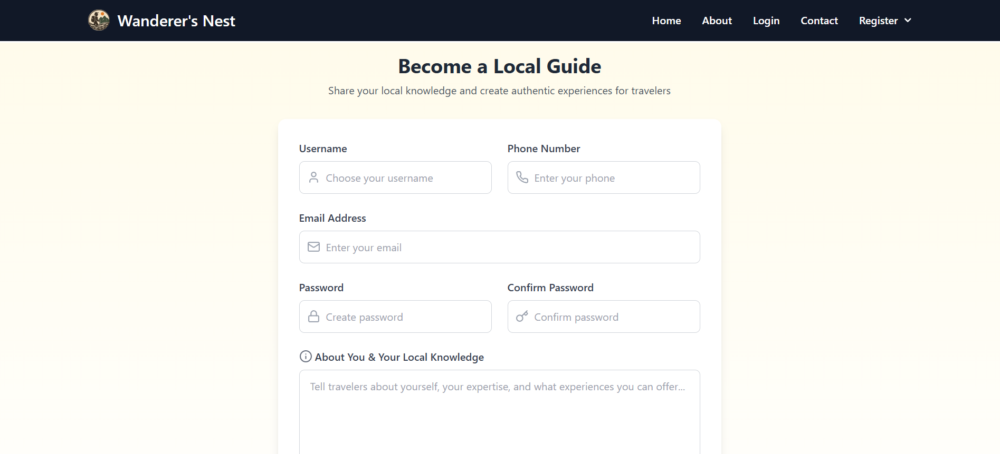

# Wanderer's Nest - Community Tourism Platform


## 🌍 Overview
**Wanderer's Nest** is a community-driven tourism platform that bridges the gap between locals and tourists to foster authentic, sustainable, and personalized travel experiences. It enables travelers to discover hidden gems shared by locals. The platform includes role-based access for tourists, locals, and admins with content moderation.

👉 **Live Demo**: [Visit Wanderer's Nest](wanderer-s-nest.vercel.app)

## ✨ Key Features
- 🔎 Discover destinations with rich details
- 🗺️ Suggest offbeat locations (locals)
- 🔐 Role-based authentication (tourist, local, admin)
- ☁️ Cloudinary-based image storage
- 🛡️ Admin moderation for user-generated content

## 🛠 Tech Stack

### client-side
- React.js
- Redux Toolkit
- Tailwind CSS
- Axios, React Router, React Icons

### Backend
- Node.js, Express.js
- MongoDB Atlas
- JWT Authentication, Bcrypt, Cloudinary, CORS

## 🗂️ Project Structure
```
wanderers-nest/
├── client-side/
│   └── src/
│       ├── components/     # UI components
│       ├── pages/          # Views
│       ├── redux/          # Redux slices
│       ├── data/          # Destinations Data etc
│       └── App.js, index.js
├── backend/
│   ├── config/, models/, routes/, controllers/
│   ├── middleware/, utils/
│   └── server.js
└── README.md
```

## 🚀 Deployment

### 🌐 Live Deployment
| Layer      | Platform   | URL                                |
|------------|------------|------------------------------------|
| client-side   | Vercel | `https://wanderer-s-nest.vercel.app` |
| Backend   | Render | Render-url |
| Database   | MongoDB Atlas | Cloud-hosted MongoDB |
| Image Hosting | Cloudinary | Secure image uploads |

## Setup and Installation

### Prerequisites
- Node.js (v16+)
- MongoDB Atlas account or local MongoDB installation
- Cloudinary account for image storage
- npm (v8+)

### Installation Steps

**Clone the repository:**
```bash
git clone https://github.com/your-username/wanderers-nest.git
cd wanderers-nest
```

**Set up backend:**
```bash
cd backend
npm install
```

#### Backend (`backend/.env`)
```
MONGODB_URI=your_mongodb_connection_string
JWT_SECRET=your_jwt_secret_key
CLOUDINARY_CLOUD_NAME=your_cloudinary_cloud_name
CLOUDINARY_API_KEY=your_cloudinary_api_key
CLOUDINARY_API_SECRET=your_cloudinary_api_secret
```

**Set up client-side:**
```bash
cd ../client-side
npm install
```

#### client-side (`client-side/.env`)
```
VITE_CLOUDINARY_UPLOAD_API=your_cloudinary_url
VITE_BASE_URL= your_backend_base_url  #Example: http://localhost:3000/
```

**Start both applications:**

In one terminal (backend):
```bash
cd backend
npm run dev
```

In another terminal (client-side):
```bash
cd client-side
npm run dev
```

**Access the application:**
- client-side: http://localhost:5173
- Backend API: http://localhost:3000

## 🔐 Authentication & Roles
- JWT-based authentication stored in `localStorage`
- Common login for all users
- Distinct registration flows for tourists and locals
- Protected routes and conditional UI rendering

## 🧑‍💻 Admin Panel
- Approve or reject local submissions
- Moderate user content
- Manage destination and user data

## 📄 License
This project is licensed under the MIT License. See the [LICENSE](./LICENSE) file for details.

> **Happy Exploring with Wanderer's Nest!** 🌴🌎🧭